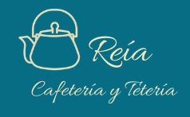

##### [Link para pagina web ]( https://cafeteriareia-6c8ba.web.app/)
## **Índice**

- [**Resumen del proyecto**](#resumen-del-proyecto)
  - [**Resumen del producto**](#resumen-del-producto)
    - [**Planificación**](#planificación)
    - [**Diseño**](#diseño)
  - [**Feedback**](#feedback)
    - [**Página web finalizada**](#página-web-finalizada)

# **Resumen del proyecto**

Desafío: Una Cafetería necesita una interfaz en la que se puedan tomar pedidos usando una tablet, y enviarlos a la cocina para que se preparen ordenada y eficientemente.

## **Resumen del producto**

Desarrollado con React.js, el proyecto tiene meta principal optimizar el tiempo entre garzones y cocineros, enfocandose en la rápidez con la cual tienen que actuar al momento de  recibir los pedidos. Nuestra página fue pensada para que sea lo más intuitivo posible su uso y no complicar la interacción entre usuarios/trabajadores.

### **Planificación**

Empezamos a planificar todo lo que seria necesario para el desarrollo de la página web utilizando el Trello, donde nos permitió una mejor visualización de todas las etapas necesarias, y dividimos las tareas por sprint.

### **Diseño**
Basado en ideas de las desarrolladoras, creamos nuestro diagrama de flujo, hecho en papel y lápiz

## **Feedback**

De acuerdo con los feedbacks recibidos:

- Mejorar el código, optimizandolo con la librería React.

### **Página web finalizada**

![Página de inicio] https://cafeteriareia-6c8ba.web.app/
![Opción de ingreso mesero] https://cafeteriareia-6c8ba.web.app/Mesero
![Opción de ingreso cocina] https://cafeteriareia-6c8ba.web.app/Cocina
![Pedidos garzón] https://cafeteriareia-6c8ba.web.app/Pedidos
![Ordenes cocina] https://cafeteriareia-6c8ba.web.app/Cocina

